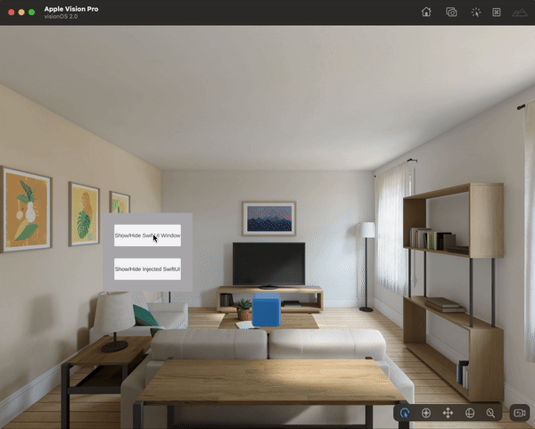

# Unity_VisionPro_SwiftUI
Intergrate SwiftUI into Unity. Using Attachments in RealityView.
> https://developer.apple.com/documentation/realitykit/realityviewattachments

# Feature
Two mode of intergated SwiftUI View.

### 1. Inject SwiftUI view into Unity's 3D scene. 

So **you can set the position/rotation** of the SwiftUI view as you want. 

Update window's position from Unity.

```c#
public void UpdateInjectSwiftUIWindowPos(Vector3 pos)
{
     UpdateInjectViewPos(pos.x, pos.y, pos.z);
}

//SwiftCode
func updatePos(x: Float, y: Float, z: Float){
    let pos = SIMD3(x, y, -z)
    attachView?.position = pos + [0.3, 0.45, 0]
}
```

```swift
//set position and orientation
attachView?.position = [0.3, 1.75, -1.2]
attachView?.orientation = simd_quatf(angle:0.4, axis: SIMD3(0, 1, 0))
```


### 2.Independent SwiftUI Window.

 (Same as the Polyspatial demo.)

> https://docs.unity3d.com/Packages/com.unity.polyspatial.visionos@1.1/manual/InteropWithSwiftUI.html




## How to start
* Build the Unity project to XCode project.

* Open `UnityVisionOSSettings.swift`

* Modify it as fllow:
  
  ```
  //Add import RealityKit. Otherwise the app will crash.(Still don't know the reason)
  import RealityKit 
  ```
  
  ```swift
  //Add the InjectRealityView here
  InjectRealityView()
  ```
  
  ```swift
  // GENERATED BY BUILD
  import Foundation
  import SwiftUI
  import PolySpatialRealityKit
  import UnityFramework
  
  //Add import RealityKit. Otherwise the app will crash.(Still don't know the reason)
  import RealityKit 
  
  let unityStartInBatchMode = true
  
  ......
  
  @SceneBuilder
    var mainScenePart0: some Scene {
  
                    ImmersiveSpace(id: "Unbounded", for: UUID.self) { uuid in
                        PolySpatialContentViewWrapper(minSize: .init(1.000, 1.000, 1.000), maxSize: .init(1.000, 1.000, 1.000))
                            ...
                            }
  
                        //Add the InjectRealityView here
                        InjectRealityView()
  
                        KeyboardTextField().frame(width: 0, height: 0).modifier(LifeCycleHandlerModifier())
                    } defaultValue: { UUID() }  ...
  
                    WindowGroup(id: "Bounded-1.000x1.000x1.000", for: UUID.self) { uuid in
                        ...
                    } defaultValue: { UUID() } ...
        SwiftUISampleInjectedScene.scene
        WindowGroup(id: "LoadingWindow") {
            Text("Loading...")
        }.defaultSize(width: 0.2, height: 0.15)
    }
  
  
  ```

* Modify `InjectRealityView()` as you want.

  
